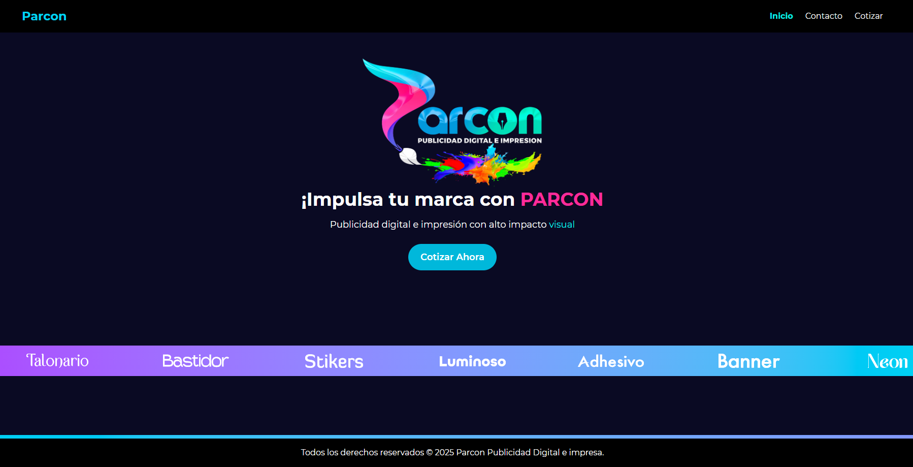

# 🚀 Parcon

¡Bienvenido a **Parcon**!  
Este es un sitio web moderno diseñado con **Astro** y **React**, enfocado en brindar experiencias web de alto rendimiento y excelente diseño visual.

[](https://parcon.netlify.app)

---

## 🌐 Vista previa

> A continuación puedes ver una imagen del sitio en producción:



---

## 🛠 Tecnologías utilizadas

- [Astro](https://astro.build/)
- [React](https://reactjs.org/)
- [Tailwind CSS](https://tailwindcss.com/)
- [Netlify](https://www.netlify.com/)
- JavaScript / TypeScript

---

## 🚧 Instalación y desarrollo local

```bash
git clone https://github.com/tu-usuario/tu-repositorio.git
cd tu-repositorio
npm install
npm run dev


## 🧞 Commands

All commands are run from the root of the project, from a terminal:

| Command                   | Action                                           |
| :------------------------ | :----------------------------------------------- |
| `npm install`             | Installs dependencies                            |
| `npm run dev`             | Starts local dev server at `localhost:4321`      |
| `npm run build`           | Build your production site to `./dist/`          |
| `npm run preview`         | Preview your build locally, before deploying     |
| `npm run astro ...`       | Run CLI commands like `astro add`, `astro check` |
| `npm run astro -- --help` | Get help using the Astro CLI                     |
